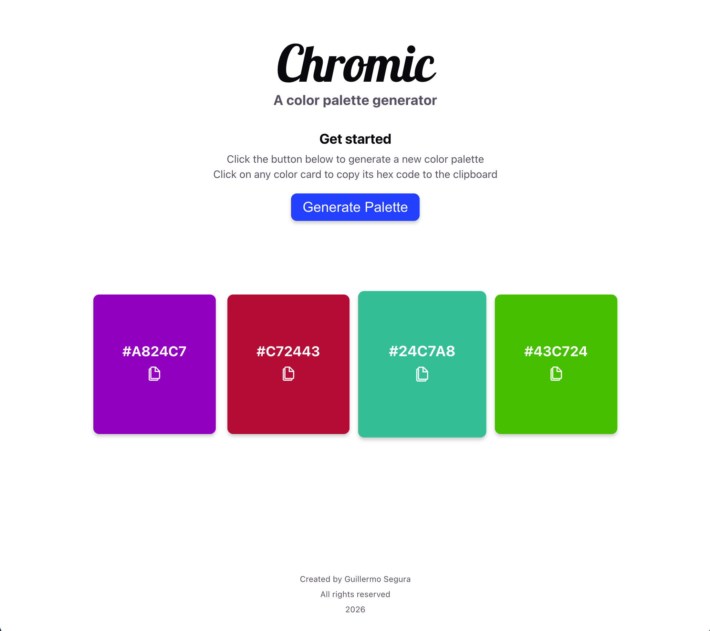
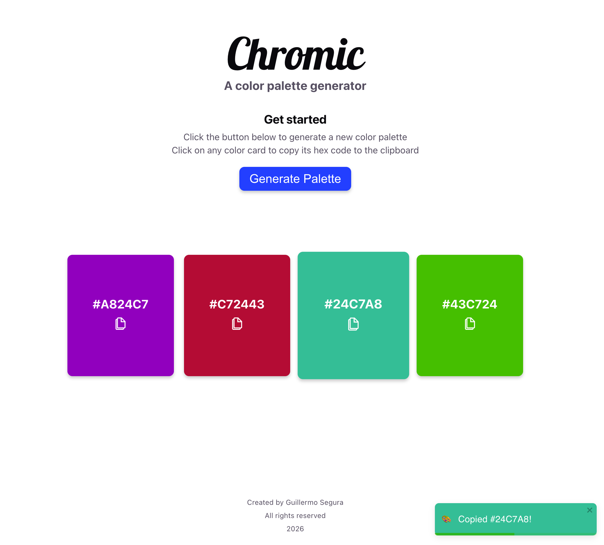

# Chromic 🎨

Chromic is a simple, elegant color palette generator built with React and TypeScript. It helps designers and developers quickly generate harmonious color palettes and easily copy exact hex codes for their projects.

## Features

- **Random Palette Generation**: Instantly generate new color palettes based on beautiful **Tetradic** color harmonies.
- **Click to Copy**: Simply click on any color card within the generated palette to automatically copy its hexadecimal color code to your clipboard.
- **Smart Notifications**: Receive immediate visual feedback when you copy a color. The toast notification matches the copied code's color for an intuitive user experience.




## Tech Stack

- [React](https://reactjs.org/) (v19)
- [TypeScript](https://www.typescriptlang.org/)
- [Vite](https://vitejs.dev/) - Fast frontend tooling
- [colortranslator](https://www.npmjs.com/package/colortranslator) - Used for calculating precise color harmonies
- [react-toastify](https://fkhadra.github.io/react-toastify/) - Used for customized notification popups

## Getting Started

### Prerequisites

Make sure you have [Node.js](https://nodejs.org/) installed on your machine.

### Installation

1. Clone the repository or download the source code.
2. Navigate to the project directory:

```bash
cd chromic
```

3. Install the dependencies:

```bash
npm install
```

### Running the Application Locally

Start the Vite development server:

```bash
npm run dev
```

Your app will be available on `http://localhost:5173/` (or the port specified by Vite in your terminal).

## Building for Production

To create an optimized production build, run:

```bash
npm run build
```

This will run TypeScript type checking and then package your files into the `dist` directory. You can preview this build using:

```bash
npm run preview
```
